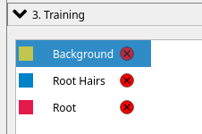
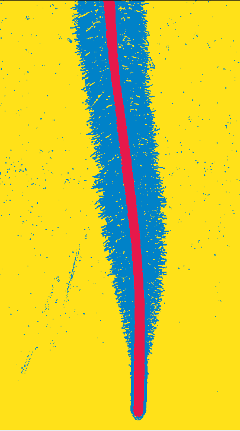

# pyRootHair


Welcome to the pyRootHair github repository! 

Here, you will find all necessary information on how to install and setup pyRootHair, detailed information about the various pipelines and options available, and an in-depth tutorial on how pyRootHair works.

Please do not hesitate to submit a pull-request, or get in touch via email if you have any questions, suggestions or concerns.

If you have used pyRootHair in your work, please cite the following paper: XXX


## Table of Contents
- [pyRootHair](#pyroothair)
  - [Table of Contents](#table-of-contents)
  - [Installation instructions](#installation-instructions)
  - [User Guide](#user-guide)
    - [Default Pipeline](#default-pipeline)
      - [Flags/Arguments](#flagsarguments)
        - [`-i/--input`](#-i--input-required---argument---string)
        - [`-o/--output`](#-o--output-required---argument---string)
        - [`--batch_id/-b` ](#--batch_id-b-required---argument---stringintfloat)
        - [`--conv`](#--conv-optional---argument---int)
        - [`--resolution`](#--resolution-optional---argument---int)
        - [`--frac`](#--frac-optional---argument---float)
        - [`--plot_segmentation`](#--plot_segmentation-optional---flag)
        - [`--plot_transformation`](#--plot_transformation-optional---flag)
        - [`--plot_summary`](#--plot_summary-optional---flag)
        - [`-p/--pipeline`](#-p--pipeline-optional---argument---str)
        - [A Full Example](#a-full-example)
    - [Random Forest Pipeline](#random-forest-pipeline)
      - [Training the Random Forest Model](#training-the-random-forest-model)
      - [Deploying the Random Forest Model](#deploying-the-random-forest-model)
    - [Single Mask Pipeline](#single-mask-pipeline)
  - [Generating Binary Masks](#generating-binary-masks)
  - [Data Output](#data-output)
  - [Input Images](#input-images)
    - [Naming Images](#naming-images)
    - [Image Format](#image-format)
    - [Image Dimensions](#image-dimensions)
  - [pyRootHair Workflow](#pyroothair-workflow)


## Installation instructions

```bash
conda create --no-default-packages -n pyroothair python # create fresh conda environment
conda activate pyroothair # activate environment
conda env config vars set nnUNet_raw='~/nnUNet_raw' nnUNet_preprocessed='~/nnUNet_preprocessed' nnUNet_results='~/nnUNet_results' # optional: set nnUNet environment variables to conda env to avoid warning when **running** pyRootHair. Ignore if you already have nnUNet paths setup

conda deactivate pyroothair
conda activate pyroothair
python -m pip install --index-url https://test.pypi.org/simple/ --extra-index-url https://pypi.org/simple/ pyroothair
```  
After installation, run `pyroothair`. You should be greeted with this output:

```
#########################################
     Thank you for using pyRootHair!     
#########################################


...No GPU Detected...

usage: pyRootHair [-h] [-i [IMG_DIR]] [-b [BATCH_ID]] [-p [{cnn,random_forest,single}]] [--resolution [HEIGHT_BIN_SIZE]]
                  [--conv [CONV]] [--frac [FRAC]] [-o SAVE_PATH] [--plot_segmentation] [--plot_transformation]
                  [--plot_summary] [--rfc_model_path RFC_MODEL_PATH]
                  [--sigma_min SIGMA_MIN] [--sigma_max SIGMA_MAX] [--input_mask [INPUT_MASK]]
pyRootHair: error: The following arguments are required when running pyRootHair using the main pipeline: ['-i/--input', '-b/--batch_id']
```

## User Guide

### Default Pipeline
The default segmentation pipeline in pyRootHair uses a CNN to perform image segmentation. As such, a GPU is required to maximize segmentation speed and performance. However, it is still possible to run the default segmentation pipeline without a GPU, if you do not have access to one. Segmentation performance will be **extremely** slow when using a CPU, and will very likely produce out-of-memory crashes unless your images are very small in size.

The following arguments are required to run the standard segmentation pipeline:

```bash
-i/--input: the filepath to the directory containing the images you want to process  
-b/--batch_id: a unique ID associated with each batch of images you are processing per run. Can be species/genotype name, or date, or anything that is easily identifiable for you
-o/--output: filepath to location to store data, plots and segmentation masks
```
Request a GPU on your cluster. On a SLURM system, this requests a single GPU with 30GB VRAM:

```bash
srsh --partition=gpu --gpus=1 --mem=30G
```

To verify a GPU has been correctly requested, run `nvidia-smi`. You should get some information about the GPU printed to your screen.

A basic command to run pyRootHair is as follows:

```bash
pyroothair -i ~/Images/Wheat/Brompton/ -b Brompton -o ~/Output/
```
#### Flags/Arguments

To view options/help messages for each flag, enter `pyroothair -h`

##### `-i/--input` (REQUIRED - ARGUMENT - STRING)
Filepath containing your input images. You can split your images into folders depending on what makes sense for your inputs. Images can be split by genotype, species, condition, treatment, timestamp etc. Required if using the main pipeline or the random forest pipeline. See [more](https://github.com/iantsang779/pyRootHair?tab=readme-ov-file#input-images) about image requirements.

##### `-o/--output` (REQUIRED - ARGUMENT - STRING)
Filepath to store outputs. By default, only the raw and summary data tables will be saved to this path. Any additional outputs (e.g. with `--plot_segmentation`) will be stored here as well. Required if using the main pipeline or the random forest pipeline. The structure of the output directory is as follows:

- `adjusted_images`: A copy of the raw input images provided with `-i`, but images are renamed with a suffix  
- `masks`: Binary segmentation masks corresponding to the input images  
- `plots`: Location of stored plots for `--plot_segmentation`, `--plot_summary` and `--plot_transformation`.
- `data`: Location of stored data tables for each batch of images, including summary and raw tables. See [this](https://github.com/iantsang779/pyRootHair?tab=readme-ov-file#data-output) section for more information on the summary data tables.

##### `--batch_id/-b` (REQUIRED - ARGUMENT - STRING/INT/FLOAT)
In the above example, the renamed images will be stored in `~/Output/adjusted_images/Brompton`, and segmentation masks will be stored in `~/Output/masks/Brompton`. The `--batch_id/-b` argument assigns a unique ID to the entire batch of images given by `-i`. This could be an ID for a particular genotype (e.g. Brompton, a wheat variety), or a timestamp (e.g. each batch of images are from a specific timepoint). You must assign a unique ID for each run of new images! Required if using the main pipeline or the random forest pipeline.

##### `--conv` (OPTIONAL - ARGUMENT - INT)
You must ensure that all input images for each batch were taken using at the same magnification setting. You will need to adjust the pixel to mm conversion factor for your input images, which you can determine from measuring a scale bar on your images using the FIJI (ImageJ) 'Analyze' > 'Set Scale' option. You must set the number of pixels per mm using `--conv` each time you run pyRootHair. If you have images taken at different magnification settings, you will need to split them into separate batches, and manually adjust the value of `--conv`.

##### `--resolution` (OPTIONAL - ARGUMENT - INT)
pyRootHair computes a sliding window down the root, and takes measurement from bins. Using `--resolution`, you can tweak the bin size (in pixels) of the sliding window. For example, if your input images have the shape 800 (width) x 1500 (height), there will be 75 data points ($\frac{1500}{20} = 75$) for RHL and RHD for each side root hair segment using the default `--resolution` value of 20 pixels. 

##### `--frac` (OPTIONAL - ARGUMENT - FLOAT)
Controls the degree of LOWESS smoothing for the lines used to model average RHL and RHD for each image. Since measurements from each bin in the sliding window is noisy, a smoothed line over these points reduces the effect of variation between bin measurements. A smaller value for `--frac` decreases the smoothing effect, i.e. the line will better fit the RHL/RHD data for each bin, but will fluctuate significantly. A larger value for `--frac` increases the smoothing effect, i.e the line will be much smoother through the RHL/RHD data for each bin, but be a worse fit. See [this](https://github.com/iantsang779/pyRootHair/blob/main/workflow.md#summary-plots) for a visual representation of the regression lines. Value must be a floating point number (e.g. 0.15) between 0 and 1. The default value is recommended. 

##### `--plot_segmentation` (OPTIONAL - FLAG)
Toggle plotting of segmented masks for each image. For each input image, `--plot_segmentation` saves the straightened mask, a mask of just the root hair segments, and the cropped root hair segments. Masks are saved in filepath specified in `--output` under `output/plots`

##### `--plot_transformation` (OPTIONAL - FLAG)
Toggle plotting of co-ordinates illustrating how each root is warped and straightened. Can be helpful to check if an image has been poorly warped. Plots are saved in filepath specified in `--output` under `output/plots`

##### `--plot_summary` (OPTIONAL - FLAG)
Toggle plotting of summary plots describing RHL and RHD for each input image. Plots are saved in filepath specified in `--output` under `output/plots`

##### `-p/--pipeline` (OPTIONAL - ARGUMENT - STR)
Specify which pyRootHair pipeline to run. By default, the main pipeline (`-p cnn`) uses a CNN to segment input images, with or without a GPU (GPU preferred, of course!). If you wish to use a random forest model instead to perform image segmentation, you must specify `-p random_forest`. If you wish to process a single input binary mask with pyRootHair, you must specify `-p single`. 

##### A Full Example

Here is a full command example, saving all diagnostic/summary plots, with a pixel:mm conversion factor of 100, 0.1 smoothing factor, and a bin size of 50 px:

```bash
pyroothair -i /path/to/image/folder -b batch_id -o /path/to/output/folder --plot_segmentation --plot_summary --plot_transformation --conv 100 --frac 0.1 --resolution 50
```

### Random Forest Pipeline
If you do not have access to a GPU, it is possible to train your own random forest segmentation model. The random forest segmentation model is nowhere near as powerful as the CNN, and as such, will struggle with image anomalies or noise. Please note this is an experimental feature, and should be used with caution.

You will need to ensure that all the images are relatively consistent in terms of lighting, appearance, root hair morphology, and have the same input dimensions. Should your images vary for these traits, you will need to train separate random forest models for different batches of images.

#### Training the Random Forest Model
To train a random forest model, you will need to train the model on a single representative example of an image, and a corresponding binary mask of the image. See [this](https://github.com/iantsang779/pyRootHair?tab=readme-ov-file#generating-binary-masks) section for details on how to generate suitable binary masks.

Once you have generated a suitable mask, you can train a random forest model like so:

```bash
pyroothair_train_rf_model --train_img /path/to/representative/training/image/example --train_mask /path/to/generated/binary/mask --model_output /path/to/output/rf_model/
```

If successful, you should see `...RFC model saved as /path/to/output/rf_model.joblib...`, indicating the random forest model has been saved in `--model_output`. There are some additional flags/arguments that allow you to toggle the behaviour of how the random forest model is trained, please see the [documentation](https://scikit-learn.org/stable/modules/generated/sklearn.ensemble.RandomForestClassifier.html) from scikit-learn on the `RandomForestClassifier` for more information. 

**`--sigma_min`**: Minimum sigma (blurring factor) for feature extraction from the input image. Default = 1  
**`--sigma_max`**: Maximum sigma (blurring factor) for feature extraction from input image. Default = 4  
**`--n_estimators`**: Number of trees in the Random Forest Classifier. Default = 50  
**`--max_depth`**: Maximum depth of the Random Forest Classifier. Default = 10  
**`--max_samples`**: Number of samples extracted from image features to train each estimator. Default = 0.05  

#### Deploying the Random Forest Model
Once your random forest model is trained, you can deploy it like so:

```bash
pyroothair -i /path/to/input/image/folder -b batch_id -o /path/to/output/folder -p random_forest -rfc_model_path /path/to/rf_model.joblib
```

The command is the same as before, but you specify to run the random forest pipeline with `-p random_forest`, and provide the path to the trained model for `--rfc_model_path`.

### Single Mask Pipeline
If you wish, you can also run pyRootHair on a single, user generated binary mask of an input image. See [this](https://github.com/iantsang779/pyRootHair?tab=readme-ov-file#generating-binary-masks) for instructions on generating binary masks. 

To run pyRootHair on a single binary mask (with classes converted!):

```bash
pyroothair --input_mask /path/to/converted/binary/mask -p single -o /path/to/output
```

Note that you no longer require `-i` or `-b` when using this pipeline option.

## Generating Binary Masks
pyRootHair will accept binary masks of any images as long as they are arrays of 0s, 1s and 2s. It is recommended that you use the [ilastik](https://www.ilastik.org/) software to generate the masks, as it is simple and requires minimal expertise to use.

This section is not a tutorial on how to use ilastik, rather, a demonstration on what the masks need to look like if you wish to generate your own masks suitable for pyroothair.

1.) Under the `1. Input Data` tab, upload your raw image(s). Ensure that the input image only has 3 channels! 
2.) Select all features under the `Feature Selection` tab.  
3.) Specify the following label categories. The label order **must** be in the exact order as shown here!  



4.) Ensure that the root hairs wrap around the root, especially at the root tip:



5.) After generating the mask, select `Source: Simple Segmentation` under `4. Prediction Export`. Click on `Choose Export Image Settings`, and set the output file format to `.png`, then hit `Export All`. 

6.) Once generated, the mask should be converted such that each pixel is a 0, 1 or 2 in the array. By default, ilastik saves each pixel associated with the background as 1, root hair as 2, and root as 3. 

If you are using the generated mask to train a random forest model, ***IGNORE the rest of this step!***. However, if you are going to load the mask into pyRootHair with `-p single` and `--input_mask`, please read on:

You will need to convert the pixel classes of the generated binary mask as follows: 

```bash
pyroothair_convert_mask -i path/to/your/generated/mask
```

You should see a the following message if the conversion has been successful: `...Saved converted input mask XXX in ZZZ...`. You can now process this mask with pyRootHair: `pyroothair -p single --input_mask /path/to/converted/mask`.

## Data Output

pyRootHair will combine all the raw data from each image into a single CSV file, called {batch_id}_raw.csv. The raw data file contains the RHL and RHD measurements from each bin in the sliding window, measured down the root, for each image. The summary data file calculates summary parameters on an individual image basis.

Here is an example of a raw table, where each entry refers to a measurement from an individual bin from the sliding window down each root hair section.

```bash
              Name  Distance From Root Tip (mm)     RHL 1     RHL 2     RHD 1     RHD 2
0    brompton_0011                    21.176471  1.950980  1.823529  0.352653  0.181949
1    brompton_0011                    20.980392  1.833333  2.009804  0.298155  0.367263
2    brompton_0011                    20.784314  1.784314  2.107843  0.292580  0.378604
3    brompton_0011                    20.588235  1.862745  2.186275  0.275952  0.382161
4    brompton_0011                    20.392157  1.803922  1.794118  0.311130  0.317186
..             ...                          ...       ...       ...       ...       ...
128  brompton_0007                     0.980392  0.000000  0.000000  0.000000  0.000000
129  brompton_0007                     0.784314  0.000000  0.000000  0.000000  0.000000
130  brompton_0007                     0.588235  0.000000  0.000000  0.000000  0.000000
131  brompton_0007                     0.392157  0.000000  0.000000  0.000000  0.000000
132  brompton_0007                     0.196078  0.000000  0.000000  0.000000  0.000000

```
Here is an example of a summary table, where traits are calculated at the whole image level. 

```bash
    Name    Batch_ID  Avg RHL (mm)  Max RHL (mm)  ...  Elongation Zone Stop (mm)  Elongation Zone Gradient  Root Thickness (mm)  Root Length (mm)
0  brompton_0011  Brompton      1.479847      2.058824  ...                   8.235294                  0.281298             0.845811         21.176471
0  brompton_0009  Brompton      1.395408      2.313725  ...                   9.607843                  0.300847             0.795588         18.627451
0  brompton_0005  Brompton      1.801452      2.470588  ...                   6.470588                  0.374728             0.930283         25.686275
0  brompton_0003  Brompton      1.506127      2.063725  ...                  10.588235                  0.211502             0.854809         19.607843
0  brompton_0013  Brompton      1.593682      2.235294  ...                   8.431373                  0.288480             0.907502         22.941176
0  brompton_0006  Brompton      1.801204      2.632353  ...                   5.098039                  0.520718             0.982260         19.803922
0  brompton_0004  Brompton      1.378990      2.053922  ...                   7.450980                  0.299172             0.956427         16.862745
0  brompton_0010  Brompton      1.546985      2.215686  ...                   5.686275                  0.346648             0.863971         20.784314
0  brompton_0014  Brompton      1.603784      2.289216  ...                   7.843137                  0.312141             0.930283         25.098039
0  brompton_0002  Brompton      1.851307      2.862745  ...                   7.647059                  0.349545             1.069853         22.941176
0  brompton_0008  Brompton      1.715365      2.495098  ...                   8.235294                  0.288533             0.994902         23.921569
0  brompton_0007  Brompton      1.624097      2.397059  ...                   9.411765                  0.258051             0.982208         26.078431

```

## Input Images

### Naming Images
Images must be labelled with meaningful information! You can name images with the variety, genotype, species, timestamp etc, as long as it contains information that is meaningful to you. This is because data generated by pyRootHair will refer to the image name, so ensure you provide images with a valid name!

### Image Format
Images **must** be PNG files, as the model will not work with non-PNG file formats. If you have images of other formats, please convert them to PNG.

### Image Dimensions
Input images can be of varying shapes as long as they are relatively consistent in size and have only 3 channels (R,G,B). However, it is best to keep the image shapes relatively consistent. Larger images will take more time to segment, and require significantly more GPU VRAM. 

## pyRootHair Workflow

If you are interested in learning how pyRootHair works behind the scenes, please check out [this](https://github.com/iantsang779/pyRootHair/blob/main/workflow.md) in-depth walk through with code breakdown.


