# pyRootHair

Welcome to the pyRootHair github repository! 

Here, you will find all necessary information on how to install and setup pyRootHair, detailed information about the various pipelines and options available, and an in-depth tutorial on how pyRootHair works.

Please do not hesitate to submit a pull-request, or get in touch via email if you have any questions, suggestions or concerns!


## Installation instructions

ADD DOCKER/CONDA STUFF HERE 
`mkdir ~/pyroothair`  
`git clone https://github.com/iantsang779/pyRootHair`  
`cd pyroothair`  

## How to use pyRootHair

Here is a breakdown of the basic required arguments for running pyRootHair with a GPU:

### GPU Arguments
```bash
-i/--input: the filepath to the directory containing the images you want to process  
-b/--batch_id: a unique ID associated with each batch of images you are processing per run. Can be species/genotype name, or date, or anything that is easily identifiable for you.
```
An example of a basic command is as follows:

```bash
python main.py -i ~/Images/Wheat/soissons/ -b soissons
```

### Plotting Arguments (Optional)

`--output`: [option] specify a filepath to store output data tables and plots (if plotting flags are enabled).  
`--plot_segmentation`: [flag] toggle plotting of predicted binary masks for each image (straightened mask, root hair segments, and cropped root hair segments). Must provide a valid filepath for `--output`.  
`--plot_summary`: [flag] toggle plotting of summary plots describing RHL and RHD for each image. Must provide a valid filepath for `--output`.  
`--plot_transformation`: [flag] toggle plotting of co-ordinates illustrating how each input image is warped and straightened. Useful for debugging any strangely warped masks. Must provide a valid filepath for `--output`.  

### Data Arguments (Optional)
`--resolution`: [option] change bin size (in pixels) for sliding window down each root hair segment. See [this](#extracting-traits-from-the-root-hair-mask) section for more details.  
`--split_segments`: [option] change the rectangular area of pixels to set as 'False' around the located root tip to ensure separation of the root hair mask into 2 sections, left and right. By default, the boundary of the rectangular area is 20px (width) by 60px (height). By default, the height of the rectangle is calculated by multiplying the user input/default value by 3 to ensure any thick root hair mask section around the root tip can still be split.  
`--rhd_filt`: [option] change the threshold used to filter out small RHL values calculated along the root. The predicted binary masks for each image can sometimes predict a moderately thick section of root hair around the root tip and regions where there are no visible root hairs. As such, you can manually adjust this value to ensure that bald sections of roots have 0 RHL!  
`--rhd_filt`: [option] change the threshold used to filter out small RHD values calculated along the root. Same as `--rhd_filt`.  
`--conv`: [option] conversion factor to translate pixel data to mm. Since you can only adjust the value of `--conv` once per run, you must only run pyRootHair on a batch of images that has been captured at the same magnification! If you have different images caputed at different magnification/zoom distances, you will need to split them into separate batches, and manually adjust the value for `--conv`.  
`--frac`: [option] control the degree of LOWESS smoothing of lines for average RHL, RHD, and individual segment RHL and RHD. Larger values will increase smoothing factor, while smaller values decrease the smoothing factor of the line. See [this](#summary-plots) for a visual representation of the regression lines. Value must be between 0 and 1!  

### Alternative Pipeline Options (Optional)

The following arguments are available for users that do not have access to a GPU or users that do not want to use the default segmentation model with a CPU:


## Dependencies

- python: 3.12.3
- numpy: 2.0.2
- pandas: 2.2.3
- matplotlib: 3.9.0
- imageiov3: 2.36.1
- scikit-image: 0.24.0
- scipy: 1.14.1
- statsmodels: 0.14.4
- sklearn: 1.5.2
- nnUNetv2: 2.5.1
- torch: 2.5.1

You will need a GPU with at least 20GB VRAM to utilize pyRootHair to it's fullest extent. 

## An in-depth dive into the pyRootHair workflow

This section is for users that are curious about how pyRootHair extracts traits from a given input image. In essence, this is a step by step process of the functions and logic within the source code. For this demonstration, I will be using the demo image `demo/karim_demo.png` and the corresponding binary segmentation mask `demo/karim_demo_mask.png`. 


### Loading the necessary libraries

First, Iimport the required libraries:

```python
import numpy as np
import pandas as pd
import matplotlib.pyplot as plt
import imageio.v3 as iio

from skimage.measure import label, regionprops
from skimage.morphology import skeletonize
from skimage.transform import rotate, warp, PiecewiseAffineTransform
from scipy.ndimage import convolve
from scipy.spatial.distance import euclidean
from scipy.interpolate import CubicSpline
from statsmodels.nonparametric.smoothers_lowess import lowess
from sklearn.cluster import KMeans
```

### Viewing the demo image and binary mask

Here, I first read in the raw image, and corresponding binary mask. The mask was generated by the integrated nnUNet segmentation model within pyRootHair.  

Since the mask is an array of [0, 1, 2], it will show up as a black image if you preview the image on github.   

This image was specifically chosen for a few reasons:

- Noise in the background (agar fragments)
- Root is inherently curved and not directly oriented downwards
- Presence of non-primary root sections

```python
image = iio.imread('demo/karim_demo.png')
mask = iio.imread('demo/karim_demo_mask.png')

fig, ax = plt.subplots(ncols=2, figsize=(15,10))
ax[0].imshow(image)
ax[0].set_title('Raw Image')
ax[1].imshow(mask)
ax[1].set_title('Binary Mask')
```
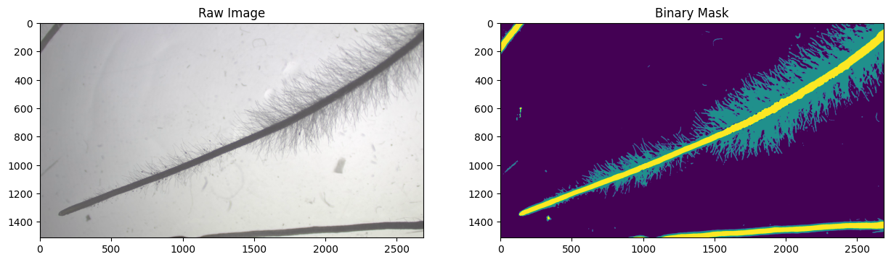

From now on, I will process the binary mask.

### Root extraction

First, I will extract just the root from the binary mask. This is needed to determine how to pre-process the mask, including rotation and subsequent straightening. 

All pixels with the class label '2' is considered part of the root, and stored in a new variable `root_mask`.

```python
root_mask = (mask == 2)

plt.imshow(root_mask)
```
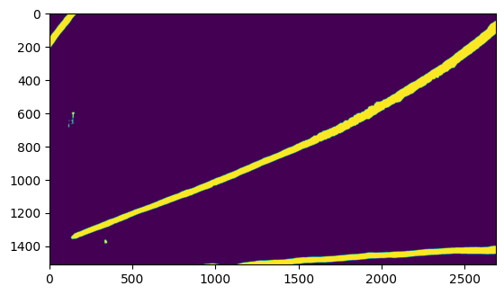

Next, I define`clean_root_chunk()` and `extract_root()`. `clean_root_chunk()` cleans up each chunk of root (or root hair) by removing all but the largest component present. `extract_root()` labels the root, and runs `clean_root_chunk()` if more than one primary fragment is detected. By running these functions on the root binary mask, only the largest root (the primary root Iare interested in) is retained.

`clean_root_chunk()` is run if more than 1 root section is detected in the root mask. The function returns the cleaned root, and a count of the number of objects in the cleaned root mask.

Cleaning the mask is extremely important to calculate accurate parameters for mask manipulation, which will soon be evident.

```python

def clean_root_chunk(mask: 'NDArray') -> tuple[NDArray, list]:
    """
    Clean up each small section of the root mask by removing all but the largest area present
    """
    root_section_labeled, num_labels = label(mask, connectivity=2, return_num=True) # label the root mask
    
    if num_labels > 0:
        root_section_measured = regionprops(root_section_labeled) # measure the root section 
        max_label = max(root_section_measured, key=lambda x: x.area).label # get the label associated with the largest area in the measured section
        
        # mask out the smaller sections, retaining only the largest section
        clean_root_mask = root_section_labeled == max_label 
        root_section_labeled, _ = label(clean_root_mask, connectivity=2, return_num=True) # re label root 
        root_section_measured = regionprops(root_section_labeled) # re measure root section

        return root_section_labeled, root_section_measured

def extract_root(root_mask: 'NDArray)
    root_labeled_clean, count = label(root_mask, connectivity=2, return_num=True)

    if count > 1:
        root_labeled_cleaned, count = clean_root_chunk(root_mask)

    return root_labeled_cleaned

root_labeled_cleaned = extract_root()
```
Here is the cleaned root mask:

```python
plt.imshow(root_labeled_cleaned)
```
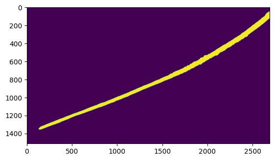

### Skeletonizing the main root

Next, the main root is skeletonized, and all the co-ordinates of the skeleton are returned.

```python
skeleton = skeletonize(root_labeled_cleaned)

skeleton_y, skeleton_x = np.nonzero(skeleton)

plt.imshow(skeleton)
```
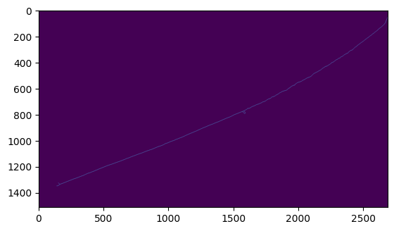

In this case, the skeletonized root is a near perfect representation of the midline of the initial root. However, in the even of poor root segmentation, the skeletonized root will be a poor approximation of the root midline. 

As such, the midline can be approximated by first fitting a spline to all co-ordinates of the skeleton:

```python
t_range  = np.arange(len(skeleton_x))
x_spline = CubicSpline(t_range, skeleton_x)(t_range)
y_spline = CubicSpline(t_range, skeleton_y)(t_range)
merged_spline = np.array(list(zip(x_spline, y_spline)))
```
The start and end points of the skeleton are calculated from the spline:

```python
skeleton_start = int(min(y_spline))
skeleton_end = int(max(y_spline))
```
Next, the midline is approximated from the spline via a sliding window to calculate the median of each bin:

```python
med_x, med_y = [], []
        
bin_size = 100
for start in range(start, end, bin_size):
    end = start + bin_size
    bin_y_val = [x[1] for x in merged_spline if start <= x[1] <= end]
    bin_x_val = [x[0] for x in merged_spline if start <= x[1] <= end]
    
    med_y.append(np.median(bin_y_val)) 
    med_x.append(np.median(bin_x_val))

```
Here is a visualization of the spline mapped to the skeleton:

```python
fig, ax = plt.subplots()
plt.plot(merged_spline[:,0], merged_spline[:,1], 'y.')
ax.yaxis.set_inverted(True)
```


### Rotating the root

Now that I have the median co-ordinates to approximate the root midline, I can calculate the angle required to rotate the root such that the root tip/end of the root in frame is pointing downwards.

Here, I calculate the change in y and change in x of the endpoints of the root midline:
```python
dy = max(med_y) - min(med_y)
dx = med_x[0] - med_x[-1]
```

Next, I calculate the angle to rotate the root relative to the vertical, and rotate the image.  
The rotated image is resized with `resize=True` to preserve resolution of the original input image.

```python
angle = np.rad2deg(np.arctan(dx/dy))
    
rotated_mask = rotate(root_labeled_cleaned, angle, preserve_range=True, resize=True, mode='constant')

plt.imshow(rotated_mask)

```
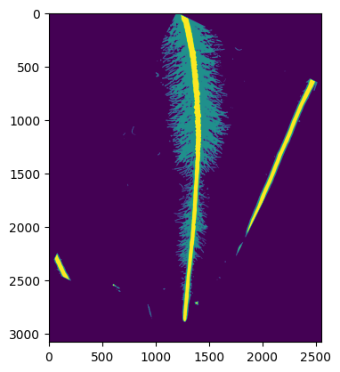

### Repeat of previous steps

Now I have a rotated mask of the original image, the previous steps are repeated:
- extract the root
- clean the root 
- skeletonize the root 
- approximate the midline of the rotated root skeleton

All repeated steps are illustrated here for convenience:

```python
### Extract root

rotated_root_mask = (rotated_mask == 2)

rotated_root_labeled_cleaned = extract_root(rotated_root_mask)

### Skeletonize root
skeleton_rotated = skeletonize(rotated_root_labeled_cleaned)

skeleton_y_rot, skeleton_x_rot = np.nonzero(skeleton_rotated)

### Map points to skeleton
t_range_rot  = np.arange(len(skeleton_x_rot))
x_spline_rot = CubicSpline(t_range_rot, skeleton_x_rot)(t_range_rot)
y_spline_rot = CubicSpline(t_range_rot, skeleton_y_rot)(t_range_rot)

merged_spline_rot = np.array(list(zip(x_spline_rot, y_spline_rot)))
skeleton_start_rot = int(min(y_spline_rot))
skeleton_end_rot = int(max(y_spline_rot))

### Sliding window to approximate midline 
med_x_rot, med_y_rot = [], []
bin_size = 100

for start in range(skeleton_start_rot, skeleton_end_rot, bin_size):
    end = start + bin_size
    bin_y_val_rot = [x[1] for x in merged_spline_rot if start <= x[1] <= end]
    bin_x_val_rot = [x[0] for x in merged_spline_rot if start <= x[1] <= end]
    
    med_y_rot.append(np.median(bin_y_val_rot)) 
    med_x_rot.append(np.median(bin_x_val_rot))
```

As you can see, the code is exactly the same as previously described, just with a few variable changes. This chunk calculates the approximated midline of the rotated root skeleton.

### Straightening the root

To obtain accurate root hair measurements, the curved root needs to be straightened as much as possible. The root will be straightened by warping. 

First, I need to add endpoints to the image to ensure all of the image is warped. Here, I define the end and second end points of each end of the rotated root skeleton:

```python
points = np.array(list(zip(med_x_rot, med_y_rot)))

first_point = points[0] 
second_point = points[1]

last_point = points[-1]
seclast_point = points[-2]
```

Next, I generate new endpoints beyond the image boundary, based on euclidean distances between the previous points. This section of code was heavily inspired by [this](https://stackoverflow.com/questions/73614379/how-do-i-use-piecewise-af%ef%ac%81ne-transformation-to-straighten-curved-text-line-cont/73620000#73620000) brilliant stackoverflow answer.

```python
def generate_endpoints(pointA: list, pointB: list, length: int) -> tuple[float, float]:
    """
    Generate new end points
    """
    len_pApB = euclidean(pointA, pointB)
    n_x = pointA[0] + ((pointA[0]-pointB[0]) / len_pApB*length)
    n_y = pointA[1] + ((pointA[1]-pointB[1]) / len_pApB*length)

    return n_x, n_y

first_x, first_y = generate_endpoints(first_point, second_point, 100)
last_x, last_y = generate_endpoints(last_point, seclast_point, 100)

# Add new end points to the beginning/end of points array
points = np.vstack([[first_x, first_y], points])
points = np.vstack([points,[last_x, last_y]])

plt.imshow(rotated_root_labeled_cleaned)
plt.scatter(points[:,0], points[:,1], s=10, marker='x')
plt.scatter(points[:,0][0], points[:,1][0], color='red', s=20)
plt.scatter(points[:,0][0], points[:,1][-1], color='red', s=20)
```
Here, this plot illustrates the addition of new endpoints (red circles) at the end of all the midline co-ordinates of the rotated root mask (blue `x`s).


The red endpoints ensure all y-pixels will be captured in the warping. Next, I create a new set of vertical points, originating from the newly created first co-ordinate of the root skeleton midline (top red circle). This vertical line defines the destination for transformation, mapping the curved blue `x`s to the orange `*`s:

```python
dist = [euclidean(x,y) for x,y in zip(points, points[1:])] # euclidean distance between each midline point
dist_lookup = list(zip(points[:-1],dist))

old_p = points[0]
new_p = old_p + (0, dist[0])
new_points = [old_p, new_p,]

# create new array to store co-ordinates of new points 
for x in dist_lookup[1:]:
    last_point = new_points[-1]
    _, dist = x

    length = euclidean(old_p, last_point)
    new_y_val = last_point[1] + ((last_point[1] - old_p[1]) / length*dist)
    new_points.append([old_p[0], new_y_val]) 

new_points = np.array(new_points)

plt.imshow(rotated_root_labeled_cleaned)
plt.scatter(points[:,0], points[:,1], s=10, marker='x')
plt.scatter(new_points[:,0], new_points[:,1], s=10, marker='*', color='orange')
plt.scatter(points[:,0][0], points[:,1][0], color='red', s=20)
plt.scatter(points[:,0][0], points[:,1][-1], color='red', s=20)
```

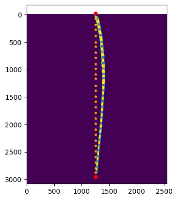

Afterwards, I generate old and new buffer co-ordinates to pad around the image, defining the x-region to capture during warping. The old buffer (blue) co-ordinates on either side are parallel to the original root curvature, while the new buffer (orange) co-ordinates are straight, parallel to the new vertical line originating below the first red point.

```python
padding = rotated_mask.shape[1] 

old_buffer_coords = np.vstack([points+[padding,0], points+[-padding,0]])
new_buffer_coords = np.vstack([new_points+[padding,0], new_points+[-padding,0]])

plt.imshow(rotated_root_labeled_cleaned)
plt.scatter(points[:,0], points[:,1], s=10, marker='x', color='blue')
plt.scatter(new_points[:,0], new_points[:,1], s=15, marker='*', color='orange')
plt.scatter(old_buffer_coords[:,0], old_buffer_coords[:,1], s=15, marker='x', color='blue')
plt.scatter(new_buffer_coords[:,0], new_buffer_coords[:,1], s=15, marker='*', color='orange')
plt.scatter(points[:,0][0], points[:,1][0], color='red', s=20)
plt.scatter(points[:,0][0], points[:,1][-1], color='red', s=20)
```
 
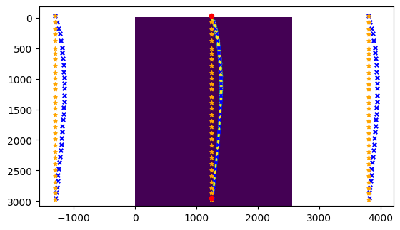

Finally, I can apply a piecewise affine transformation, which maps all co-ordinates in the image from the regions bound by the blue `x`s to the orange `*`s:

```python

tform = PiecewiseAffineTransform()
tform.estimate(new_buffer_coords,old_buffer_coords)

straight_mask = warp(rotated_mask, tform, mode='symmetric')
```
The original binary mask is now straightened:

```python 
plt.imshow(straight_mask)
```
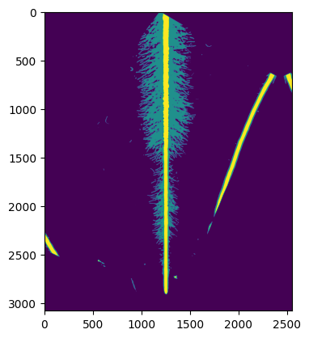

### Locate root endpoint

With the straightened binary mask, I can now attempt to locate the root tip/endpoint of the root in frame. 

During the warping process, some pixels may be lost, so when re-extracting the root from the binary mask, I reduce the mask criteria from 2 to 1.5:

```python
final_root_mask = (straight_mask > 1.5)
```

Now, I clean up the root mask, and calculate the lowest y co-ordinate of the root, and the image height. If the lowest root y co-ordinate is smaller than the image height, then either the root tip, or the end of the root can be detected in frame:

```python

final_root_labeled = extract_root(final_root_mask)

root_measured = regionprops(final_root_labeled) # measure cleaned root
coords = [i.coords for i in root_measured][0] # get all coords of masked cleaned root
max_root_y_coord = max(coords[:,0]) # get max y-coord of cleaned root
image_height = straight_mask.shape[0] # get height of the image

if image_height - max_root_y_coord > 1: # if > 1 px difference between image height and max y of root
    found_tip = True 
```

If found_tip is True, I can locate the root tip using kernel convolution along the skeletonized straight root mask. The kernel will return values of 3 for each edge pixel in the skeleton, as each edge pixel will only have 1 neighbour. 

Next, I obtain a list of all the calculated endpoints from convolution, and the root tip/end of the root is set as the last value of the endpoints list. The top of the root in frame is set as the first value of the endpoints list:

```python
if found_tip:
    final_skeleton = skeletonize(final_root_labeled)
    kernel = np.array([[1,1,1], 
                        [1,2,1],  # each pixel in sliding window has value of 2 (2 x 1), while neighboring pixels have a value of 1 
                        [1,1,1]]) # define kernel that slides over each pixel in the rotated root skeleton.


    neighbours = convolve(final_skeleton.astype(int), kernel, mode='constant') # apply convolution to skeleton to find out which pixels have 1 neighbour
    endpoints = np.where(neighbours == 3) # edges only have 1 neighbour, so 2 + 1 = 3
    endpoints = list(zip(endpoints[0], endpoints[1])) # store results in paired list 
    root_tip = max(endpoints, key = lambda x: x[0]) # get coords where y-coord is max (bottom of root - assuming root growing downwards)
    root_start = min(endpoints, key=lambda x: x[0]) # coords of where root starts
    root_tip_y, root_tip_x = root_tip 
    root_start_y, root_start_x = root_start
```
I can visualize the root tip/end of root, and the start of the root overlayed on the straightened root skeleton:

```python
plt.imshow(final_skeleton)
plt.plot(root_tip_x, root_tip_y, 'yo')
plt.plot(root_start_x, root_start_y, 'g+')
```
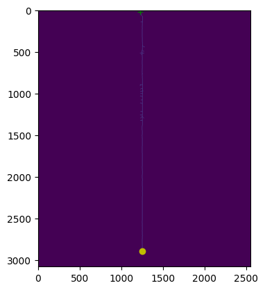

### Processing the root hair mask
Next, I extract out the root hair mask from the rotated binary mask and visualize it:

```python
rh_mask = (straight_mask > 0.4) & (straight_mask <= 1.4)

plt.imshow(rh_mask)
```
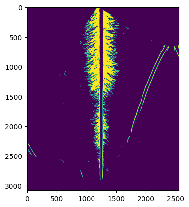

To eliminate all but the primary root hair sections (i.e what I am trying to measure in this image), here I label the root hair mask, and calculate the area of all objects in the mask

```python
rh_mask_labeled, rh_count = label(rh_mask, connectivity=2, return_num=True)
rh_props = regionprops(rh_mask_labeled)
areas = [i.area for i in rh_props]
```

Next, I create a new blank array mask, which has the same shape as the root hair mask, containing only `True`s. I then convert and reshape the areas list into a 2D array, and cluster the areas of all objects in the root hair mask into 2 categories using KMeans clustering.

Since the primary root hair sections should have a much larger area than all other objects, the main cluster will contain the area(s) of the primary root hair sections, while the other cluster will contain the areas of all other objects I would like to ignore. Alternatively, you could use the `remove_small_objects()` function from `skimage.morphology`. However, that approach would likely require manual tweaking of the `min_size` threshold depending on different images and species. I think the K-means clustering approach is more robust. 

Next, I extract the area of the main root hair segment, and iterate over each object's region. For each area that has been clustered into the main root hair cluster, I add that corresponding section into the `new_rh_mask`, which generates a mask of just the primary root hair.

```python
new_rh_mask = np.full(rh_mask.shape, fill_value=False) # create array of all False's of same shape as rh mask

if rh_count > 2:
    areas_reshaped = np.reshape(areas, (-1, 1)) # reshape areas for kmeans clustering

    kmeans_areas = KMeans(n_clusters=2).fit(areas_reshaped)
    # rh_to_ignore = areas[kmeans_areas.labels_ == 0] # areas of everything else to ignore
    main_rh_area = areas_reshaped[kmeans_areas.labels_ == 1] # area of main rh segments (either connected, as 1 area, or 2 large areas)
    
    for i in rh_props: # iterate over all regions
        for z in main_rh_area: # iterate over all areas in main_rh_area
            if i.area == z:
                new_rh_mask[rh_mask_labeled == i.label] = rh_mask[rh_mask_labeled == i.label]

    rh_mask = new_rh_mask

plt.imshow(rh_mask)
```
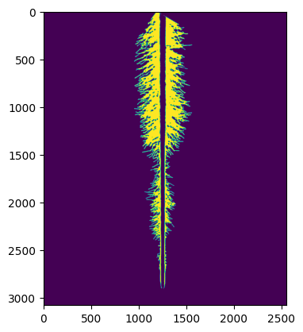

Now that I have a cleaned root hair mask, I can split the root hair segment into 2 sections, corresponding to the left and right sides. To do this, I will use the previously calculated root tip co-ordinate by padding 50 pixels around the root tip in both the x and y direction. Next, this square region is set to False in the binary root hair mask, which ensures that the left and right root hair sections are split.

```python
padding = 50

if found_tip:
    root_tip_y_max, root_tip_y_min = root_tip_y + padding, root_tip_y - padding
    root_tip_x_max, root_tip_x_min = root_tip_x + padding, root_tip_x - padding

    root_start_y_max, root_start_y_min = root_start_y + padding, root_start_y - padding
    root_start_x_max, root_start_x_min = root_start_x + padding, root_start_x - padding 

    rh_mask[root_tip_y_min:root_tip_y_max, root_tip_x_min:root_tip_x_max] = False # apply coords to mask
    rh_mask[root_start_y_min:root_start_y_max, root_start_x_min:root_start_x_max] = False

final_rh_mask_labeled, count = label(rh_mask, connectivity=2, return_num=True)

fig, ax = plt.subplots()
ax.imshow(final_rh_mask_labeled)
```
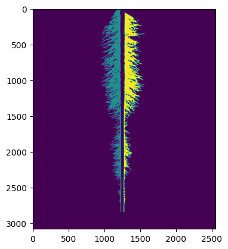

The root hair mask has now been split at the root tip into 2 sections. 

Finally, the mask is cropped to ensure that each section is of even length. This is done automatically by calculating all the co-ordinates of the root hair mask, then cropping based on the min and max y co-ordinate values.

```python
def get_region_coords(mask) -> list:

    props = regionprops(mask)
    coords = [i.coords for i in props]
    return coords

coords = get_region_coords(final_rh_mask_labeled)

crop_start = max(np.min(coords[0][:,0]), np.min(coords[1][:,0]))
cropped_rh_mask = final_rh_mask_labeled[crop_start:,:] # crop the final root hair section to the start of the shorter root hair segment for uniform calculation

coords = get_region_coords(cropped_rh_mask) # re-calculate coordinates of cropped image

crop_end = min(np.max(coords[0][:,0]), np.max(coords[1][:,0])) # crop ends of root hair sections
final_rh_mask = cropped_rh_mask[:crop_end, :]

plt.imshow(final_rh_mask)
```
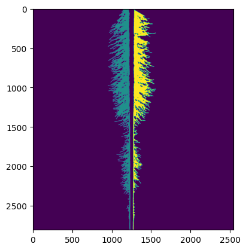

### Extracting traits from the root hair mask

Now, I have a cleaned, separated mask of both root hair segments. To extract traits from the masks, I first calculate the area of each segment and the maximum height of the mask, which is used to set the maximum height of the sliding window:

```python
root_hair_segment_props = regionprops(final_rh_mask)
root_hair_coords = [i.coords for i in root_hair_segment_props] # all coordinates of root hair segments
max_height = max(np.max(root_hair_coords[0][:,0]), np.max(root_hair_coords[1][:,0])) # get max height of root hair segment
```

Next, I define the bin size required to perform measurements, and initialize empty lists for root hair length (RHL), root hair density (RHD), and bin positions for each segment:

```python
height_bin_size = 100
horizontal_rh_list_1, horizontal_rh_list_2 = [], []
rh_area_list_1, rh_area_list_2 = [], []
bin_end_list_1, bin_end_list_2 = [], []
max_col_list_2 = []
```
Afterwards, I iterate over each root hair segment, and calculate the bounding box around each root hair segment to mask each segment. Then, for each segment, based on `height_bin_size`, a sliding window slides down each segment vertically, and calculates the area of each bin. I also calculate the bounding box of each binned root hair section, and calculate the horizontal root hair length from the bounding box co-ordinates. Finally, the length and area, along with the corresponding bin position, are added to respective lists for the left and right sections.

```python

for index, segment in enumerate(root_hair_segment_props): # loop over each root hair section (left and right side)
    min_row, min_col, max_row, max_col = segment.bbox # calculate binding box coords of each segment
    segment_mask = final_rh_mask[min_row:max_row, min_col:max_col] # mask each root hair segment
    # segment_mask = remove_small_objects(segment_mask, connectivity=2, min_size=200)
    
    for bin_start in range(0, max_height, height_bin_size): # sliding window down each section

        bin_end = bin_start + height_bin_size # calculate bin end
        rh_segment = segment_mask[bin_start:bin_end, :] # define mask for sliding window for root hairs
        _, rh_segment_measured = clean_root_chunk(rh_segment) 
        rh_segment_area = [segment['area'] for segment in rh_segment_measured] # area of each segment
        
        for region in rh_segment_measured: # get 
            _, min_segment_col, _, max_segment_col = region.bbox 
            horizontal_rh_length = max_segment_col - min_segment_col 
            

        if index == 0:
            horizontal_rh_list_1.append(horizontal_rh_length)
            rh_area_list_1.append(rh_segment_area)
            bin_end_list_1.append(bin_end)

                
        elif index == 1:
            horizontal_rh_list_2.append(horizontal_rh_length)
            rh_area_list_2.append(rh_segment_area)
            bin_end_list_2.append(bin_end) 
            max_col_list_2.append(max_segment_col)
 
```

The red lines illustrate the maximum root hair length within each bin. Each bin is defined as the region between each red line (height = 100px in this demonstration).

```python
plt.imshow(segment_mask)

for idx, point in enumerate(bin_end_list_1[:-1]):
    plt.plot((0, max_col_list_2[idx]), (point, point), 'r-')
```
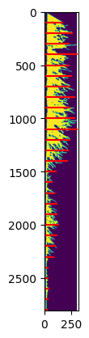

Now, I will apply thresholds for length and area if the measured parameter in each bin is small. These thresholds are adjustable via the `--length_filt` and ``--area_filt`` arguments.

```python
length_filt = 14
area_filt = 180

horizontal_rh_list_1 = [0 if i < length_filt else i for i in horizontal_rh_list_1]
horizontal_rh_list_2 = [0 if i < length_filt else i for i in horizontal_rh_list_2]

rh_area_list_1 = [0 if float(i[0]) < area_filt else float(i[0]) for i in rh_area_list_1]           
rh_area_list_2 = [0 if float(i[0]) < area_filt else float(i[0]) for i in rh_area_list_2]   
```

Currently, data is stored as number of pixels (length) and pixel area (area). Here, I convert the pixel data to milimetres.  The data is converted to mm/mm<sup>2</sup> based on a pixel:mm conversion factor, which can be adjusted by `--conv`:

```python
conv = 125

horizontal_rh_list_1 = [i/conv for i in horizontal_rh_list_1]
horizontal_rh_list_2 = [i/conv for i in horizontal_rh_list_2]

rh_area_list_1 = [i/(conv * conv) for i in rh_area_list_1]
rh_area_list_2 = [i/(conv * conv) for i in rh_area_list_2]

# reverse the order of bin_list to reflect distance from root tip/base of the root
bin_list = [i/conv for i in bin_end_list_1]
bin_list.reverse()
```

### Calculating average root thickness

To calculate the average thickness of the root, a simple sliding window is deployed down the cleaned, straightened root mask.

```python
width_list = []

root_measured = regionprops(final_root_labeled)
root_params = [i.bbox for i in root_measured]
root_start, _, root_end, _ = root_params[0]

for start in range(root_start, root_end, 100):

    end = start + 100
    root_section = final_root_labeled[start:end, :]
    _, root_section_measured = clean_root_chunk(root_section) 
    root_binned_params =  [i.bbox for i in root_section_measured]
    _, min_col, _, max_col = root_binned_params[0] # get bounding box for min and max col of root per bin
    root_width = max_col - min_col

    width_list.append(root_width)

root_thickness = np.mean(width_list) / conv

print(f'Average root thickness: {root_thickness:.4f} mm')
```
```Average root thickness: 0.3978 mm
```

### Calculating uniformity between left and right root hair segments

Given that root hair morphology is quite a plastic trait, I thought it would be a good idea to quantify the plasticity within an individual plant. The 'uniformity' is a way of quantifying how different the left and right sides of the root hair profile are.

Quantifying uniformity involves calculating the difference in RHL and RHD at each bin position along the root:

```python
delta_length = [abs(x - y) for x, y in zip(horizontal_rh_list_1, horizontal_rh_list_2)]
delta_area = [abs(x - y) for x, y in zip(rh_area_list_1, rh_area_list_2)]
len_d, len_pos = max(list(zip(delta_length, bin_list)))
area_d, area_pos = max(list(zip(delta_area, bin_list)))

print(f'Greatest delta in RHL ({len_d:.2f}) at {len_pos} mm from the root tip.')
print(f'Greatest delta in RHD ({area_d:.2f}) at {area_pos} mm from the root tip.')
```
```
Greatest delta in RHL (0.58) at 22.4 mm from the root tip.
Greatest delta in RHD (0.26) at 17.6 mm from the root tip.
```

### Calculating the position, size and gradient of the root hair elongation zone

This is probably my favourite chunk of code in pyRootHair. The objective of this section is to attempt to quantify how long the elongation zone is in an individual plant, which I can infer root hair growth rate from. Essentially, this is an attempt to quantify the 'shape' of the root hair profile.

First, I calculate the average (between the 2 segments) root hair length and density along the root:

```python
avg_rhl_list = [(x + y) / 2 for x, y in zip(horizontal_rh_list_1, horizontal_rh_list_2)]
avg_rhd_list = [(x + y) / 2 for x, y in zip(rh_area_list_1, rh_area_list_2)]
```

Now, I apply a locally weighted scatterplot smoothing (LOWESS) line through the average root hair length and density for the input image. The LOWESS line models the 'shape' of the root hairs in the image. A LOWESS line is modelled for average RHL, average RHD, as well as the RHL and RHD of each section (left and right). The degree of smoothing of the LOWESS curve is controled by `--frac`:

```python
frac = 0.15
smooth_avg_rhl = lowess(avg_rhl_list, bin_list, frac=frac) # avg rhl
smooth_avg_rhd = lowess(avg_rhd_list, bin_list, frac=frac) # avg rhl
smooth_1_rhl = lowess(horizontal_rh_list_1, bin_list, frac=frac)
smooth_2_rhl = lowess(horizontal_rh_list_2, bin_list, frac=frac)
smooth_1_rhd = lowess(rh_area_list_1, bin_list, frac=frac)
smooth_2_rhd = lowess(rh_area_list_2, bin_list, frac=frac)
```

Here is a demonstration of what the RHL LOWESS lines look like for each root hair section:
```python
fig, ax = plt.subplots()
ax.scatter(x=bin_list, y=horizontal_rh_list_1, color='darkmagenta', marker='*', alpha=0.3)
ax.scatter(x=bin_list, y=horizontal_rh_list_1, color='darkmagenta', marker='*', alpha=0.3)
ax.scatter(x=bin_list, y=horizontal_rh_list_2, color='lightseagreen', marker='X', alpha=0.3)
ax.plot(smooth_1_rhl[:, 0], smooth_1_rhl[:, 1], color='darkmagenta', linewidth=4, linestyle='dashed', label='RHL 1')
ax.plot(smooth_2_rhl[:, 0], smooth_2_rhl[:, 1], color='lightseagreen', linewidth=4, linestyle='dashdot', label='RHL 2')
ax.legend(loc='upper right')
ax.set_ylim(0, max(horizontal_rh_list_2) * 2)
ax.set_xlabel('Distance From Root Tip (mm)')
ax.set_ylabel('Root Hair Length (mm)')
```
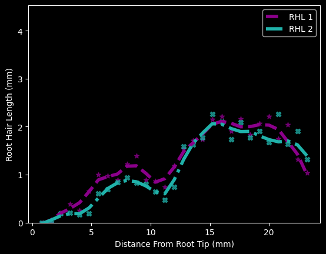

To estimate the elongation zone properties, I use the lowess line fitted to the average RHL. Next, I calculate the gradient of the average RHL, and retain regions of positive growth (where gradient > 0) in a boolean array. The array is then labeled, where regions with a '0' label indicate negative growth, and regions with a label of 1 or above indicate different regions of positive growth. Next, the regions of positive growth are grouped according to the label classes. The largest region of positive growth is determined via the `max()` function:

```python
from scipy.ndimage import label

labels, n_features = label(pos_regions) # label regions of bool array
regions = [smooth_avg_rhl[labels == i] for i in range(1, n_features + 1)]
longest_region = max(regions, key=len) # keep the longest growth region
```
Here is the `longest_region` array. This is the region where the root hairs are experiencing the largest increase in length down the root, which serves as a good estimate of the root hair elongation zone. The left column are values corresponding to the positions along the root of the region of steepest RHL growth, while the right column are values corresponding to the average RHL within this region:

```python
array([[ 0.8       , -0.02285198],
       [ 1.6       ,  0.05720767],
       [ 2.4       ,  0.16897322],
       [ 3.2       ,  0.24404293],
       [ 4.        ,  0.30158258],
       [ 4.8       ,  0.47107839],
       [ 5.6       ,  0.69792395],
       [ 6.4       ,  0.83708458],
       [ 7.2       ,  0.92053598],
       [ 8.        ,  1.02900866]])
```

Here is the elongation zone visualized:

```python
plt.plot(longest_region[:,0], longest_region[:,1])
plt.title('Longest region of positive RH growth')
```
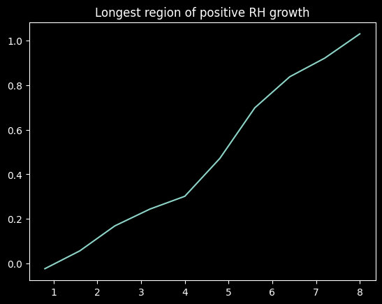

Within the elongation zone, the gradient of the zone can be calculated from the `longest_region` array. First, I get the index corresponding to the maximum RHL within this region:
```python
max_y_idx = np.argmax(longest_region[:, 1]) # get index max rhl
max_y = longest_region[max_y_idx, 1] # get max rhl value
max_x = longest_region[max_y_idx, 0] # get position along root corresponding to max rhl value
``` 
Next, I get the index corresponding to the minimum RHL within this region:
```python
min_y_idx = np.argmin(np.abs(longest_region[:, 1])) # same as above but get index where abs difference is closest to 0
min_y = longest_region[min_y_idx, 1]
min_x = longest_region[min_y_idx, 0]
```

Finally, the gradient of the elongation zone can be calculated as follows:
```python
elongation_gradient = (max_y - min_y) / (max_x - min_x)

print(f'Elongation zone gradient: {gradient:.2f}')
print(f'The elongation zone starts at: {min_x} mm from the root tip')
print(f'The elongation zone ends at: {max_x} mm from the root tip')
print(f'The length of the elongation zone is: {max_x - min_x} mm')
```
```
Elongation zone gradient: 0.15
The elongation zone starts at: 0.8 mm from the root tip
The elongation zone ends at: 8.0 mm from the root tip
The length of the elongation zone is: 7.2 mm
```
### Summary Plots

Finally, here is a summary plot displaying some of the previous calculations:
```python
fig, ax = plt.subplots()
ax.fill_between(smooth_avg_rhl[:, 0], min(gradient) * 1.1, max(avg_rhl_list) * 2, where=pos_regions, color='cyan', alpha=0.5, label='RH Growth Regions')        
ax.scatter(x=bin_list, y=avg_rhl_list, color='orangered')
ax.plot(smooth_avg_rhl[:, 0], smooth_avg_rhl[:, 1], color='darkviolet', linewidth=3, label='Avg RHL')
ax.plot((min_x, min_x), (-1, 10), color='lime', linewidth=2, linestyle='dashed', label='Primary Elongation Zone')
ax.plot((max_x, max_x),(-1, 10), color='lime', linewidth=2, linestyle='dashed')
ax.plot(smooth_avg_rhl[:, 0], gradient, color='yellow', alpha=0.8, linestyle='dashdot', label='Avg RH Gradient')

ax.set_ylim(min(gradient) * 1.1, max(avg_rhl_list) * 2)
ax.set_xlabel('Distance From Root Tip (mm)')
ax.set_ylabel('Average Root Hair Length (mm)')
ax.legend(loc='upper right')
```
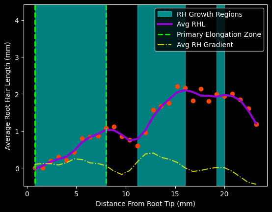


